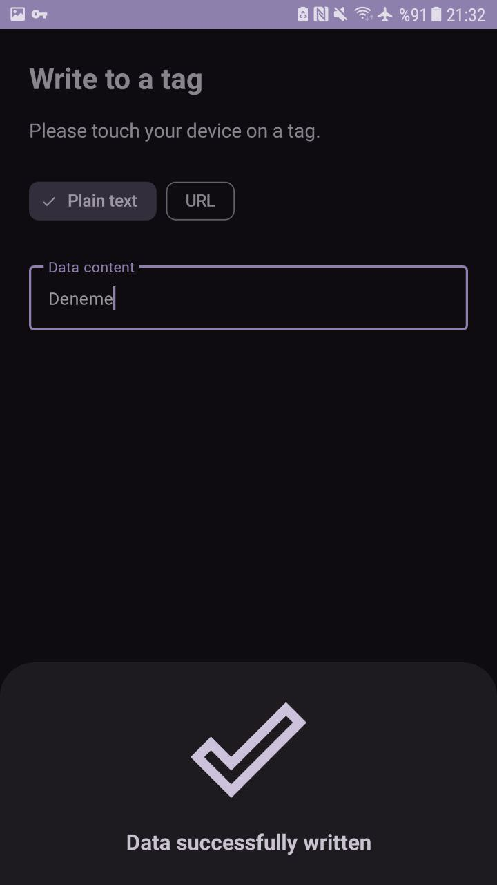

# 📱 NFC Toolkit

**NFC Toolkit** is an Android application that allows users to easily **write text or URLs** to NFC tags and **format (erase)** them when needed.

## 🚀 Features

- Write **text** or **URL** to NFC tags  
- Format/erase supported NFC tags
- Smart input validation (prevents empty or invalid URLs)
- Vibration feedback on tag detection

## 📸 Screenshots

<table>
  <tr>
    <td> </td>
   </tr> 
</table>

<table>
  <tr>
    <td> </td>
   </tr> 
</table>

<table>
  <tr>
    <td> </td>
   </tr> 
</table>

<table>
  <tr>
    <td> </td>
   </tr> 
</table>

## 🧠 Built With

- `Kotlin`  
- `Android NFC API`   
- `BottomSheetDialogFragment`

## 📦 Compile

Option 1:
1. Clone the repository:
   ```bash
   git clone https://github.com/gorkemoji/nfc-toolkit.git

2. Open with Android Studio and press run button!
